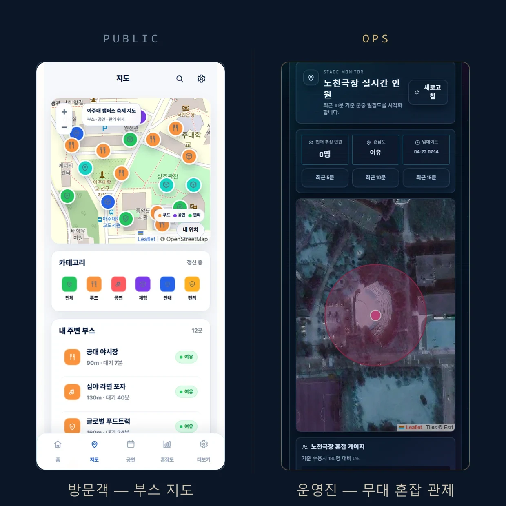
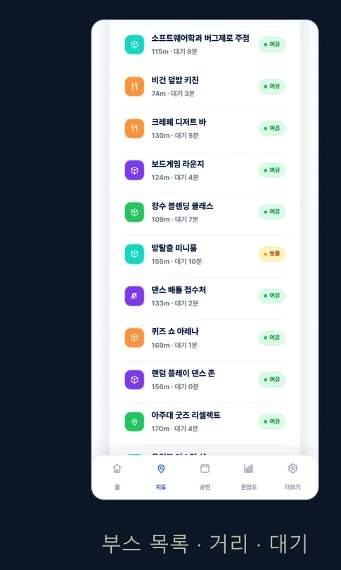
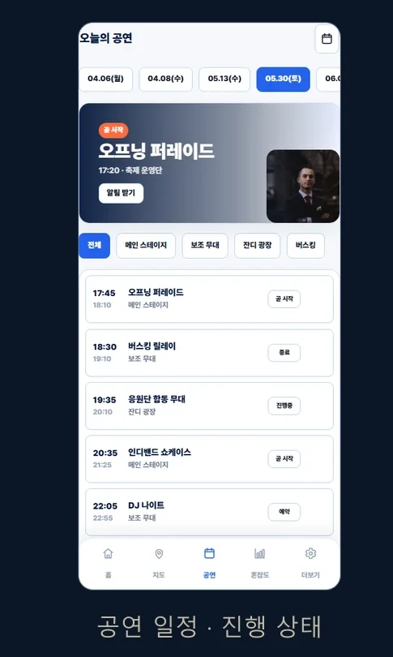
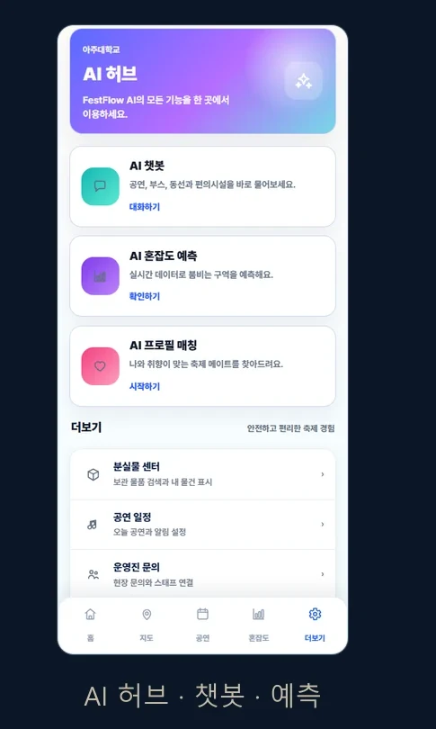
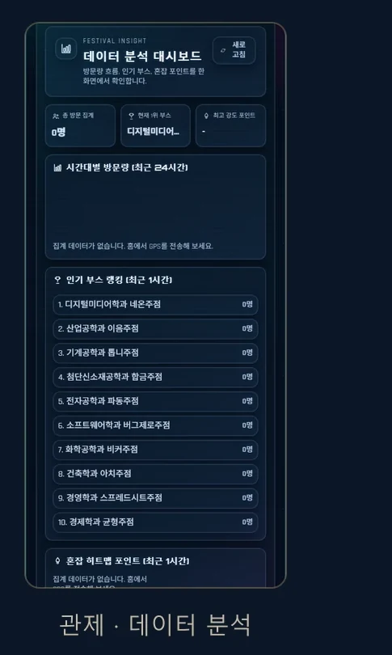
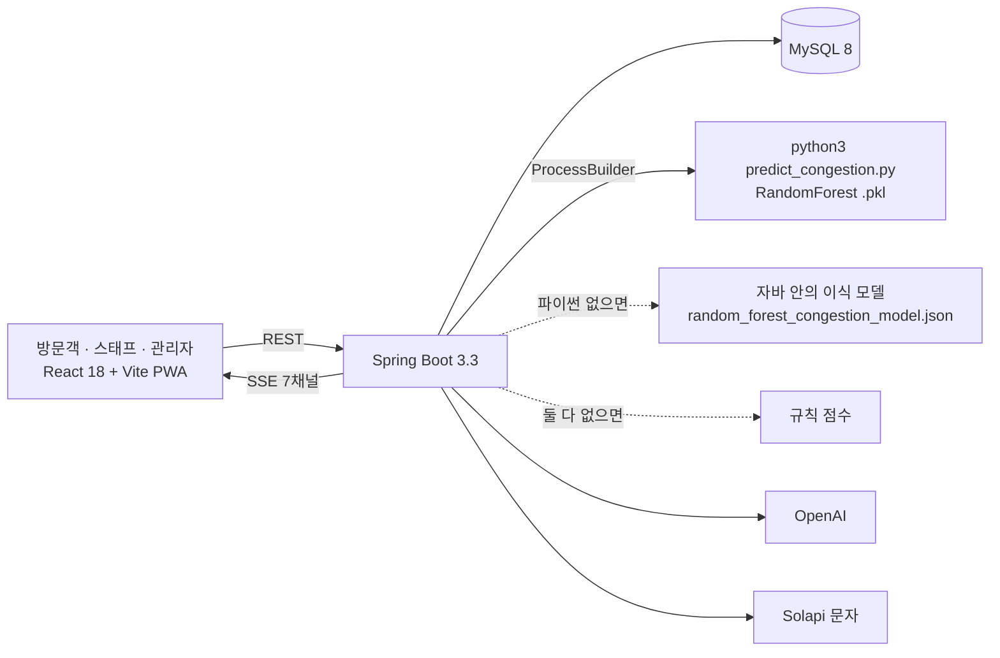
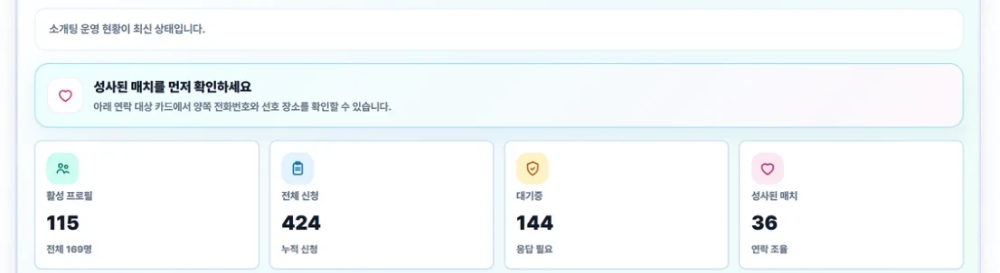
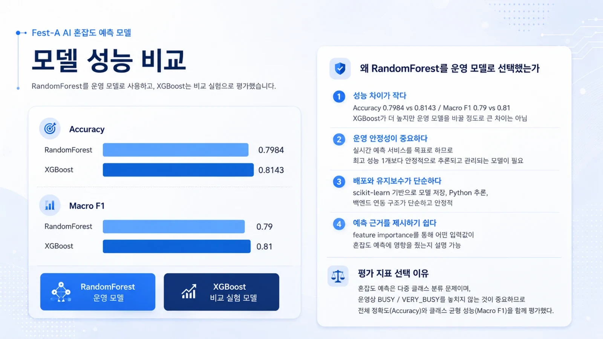

# FestFlow

대학 축제의 부스·공연·혼잡도·공지를 방문객, 스태프, 관리자가 같은 화면으로 보게 하는 웹앱. 혼자 기획하고 만들고 배포해서, 2026년 5월 아주대 대동제에서 AI Match 기능을 하루 동안 실제로 돌렸다. 저장소의 처음 이름은 Fest-A 였고(옛 README·발표자료 제목), 이력서와 배포 화면은 FestFlow 다.



| | |
|---|---|
| 기간 | 2026.04 ~ 2026.06 (첫 커밋 2026-04-01, 마지막 2026-06-13, 183 커밋) · 현장 운영 2026-05-20 ~ 22 |
| 인원 | 1명 — 기획 · 프론트 · 백엔드 · 혼잡 예측 모델 · 배포 · 현장 운영 전부 |
| 배포 | https://fest-flow-smoky.vercel.app (프론트 Vercel · 백엔드 Railway · MySQL) |
| 영상 | https://www.youtube.com/watch?v=-RomuYp93TQ |

## 5분만 있다면

1. [`StreamService.java#L78-L96`](backend/src/main/java/com/festflow/backend/service/stream/StreamService.java#L78-L96) — SSE 팬아웃의 전부. 채널마다 `SseEmitter` 목록을 들고, 끊긴 연결은 콜백과 전송 실패 두 곳에서 지운다. 98줄이 실시간의 뼈대다.
2. [`PythonCongestionModelService.java#L63-L145`](backend/src/main/java/com/festflow/backend/service/PythonCongestionModelService.java#L63-L145) — 혼잡 예측이 세 단으로 내려앉는 자리. 파이썬 프로세스 → 자바 안의 이식 모델 → 규칙 점수. 축제 당일 모델이 서비스를 끌고 내려가지 않게 한 이유가 여기 있다.
3. [`AiMatchService.java#L482-L496`](backend/src/main/java/com/festflow/backend/service/AiMatchService.java#L482-L496) — 신청 한 건이 문자 한 통이 되는 자리. 같은 상대 중복만 막고 1인당 상한이 없다는 것이 운영 당일 오후 4시에 드러났다. 아래 「운영 당일」에 그 이야기가 있다.

## 무엇이 돌아가나

| | |
|---|---|
|  |  |
| 방문객의 지도 탭. 부스마다 내 위치에서의 거리, 대기 시간, 혼잡 단계가 붙는다. 혼잡은 최근 15분 GPS 로그를 반경 80m 로 세어 시간 가중치로 매긴다([`BoothService.java#L198-L208`](backend/src/main/java/com/festflow/backend/service/BoothService.java#L198-L208)). | 공연 일정. 상태(예정·진행중·종료)는 `/api/stream/events` 로 밀려오고, 저장한 공연은 시작 10분 전에 브라우저 알림이 뜬다([`eventExperience.js#L4`](frontend/src/data/eventExperience.js#L4)). |
|  |  |
| AI 허브. 챗봇은 부스·공연·공지·분실물에서 근거를 먼저 모으고 OpenAI 에 묻되, 키가 없거나 실패하면 근거만으로 답한다([`ChatService.java#L494`](backend/src/main/java/com/festflow/backend/service/ChatService.java#L494)). AI Match 는 축제에서 실제로 쓴 소개팅 기능이다. | 운영진의 분석 대시보드. 시간대별 방문량, 인기 부스, 혼잡 히트맵 포인트를 GPS 로그에서 집계한다. |

이 밖에 관리자 콘솔(부스·공연·공지 CRUD, CSV 일괄 업로드, KPI, 감사 로그), 부스 운영 콘솔(예약·QR 체크인·메뉴), 스태프 화면, 분실물 센터, 실시간 번역, PWA 오프라인 페이지가 있다. 권한은 셋으로 갈린다 — 관리자는 JWT, 운영 콘솔은 운영 키, 나머지는 열려 있다([`SecurityConfig.java#L34-L39`](backend/src/main/java/com/festflow/backend/config/SecurityConfig.java#L34-L39)).

## 구조



| 백엔드 | 프론트 | 모델 |
|---|---|---|
| Java 17 · Spring Boot 3.3.5 · Spring Security · JPA · JWT · SseEmitter | React 18 · Vite · React Router · React Leaflet · Tailwind · PWA | Python · scikit-learn RandomForest · 24 feature |
| 컨트롤러 26 · 자바 16,462줄 · 테스트 3 파일 | 페이지 18 · JS 17,887줄 | 학습 2,520행(시뮬레이션) |

## 결정과 근거

### 실시간을 SSE 로, 그것도 종류별 채널 7개로

**문제.** 축제장에서 바뀌는 것은 전부 서버에서 화면으로 흐른다. 관리자가 공지를 올리면 방문객 화면이 바뀌어야 하고, 스태프가 예약을 받으면 운영 콘솔이 바뀌어야 한다. 반대 방향(화면 → 서버)은 전부 REST 로 충분했다.

**선택.** 단방향이라 WebSocket 을 쓰지 않고 SSE 를 썼다. 채널은 하나가 아니라 종류별로 일곱이다 — `/congestion` `/events` `/notices` `/booths` `/staff` `/lost-items` `/reservations` ([`StreamController.java#L20-L52`](backend/src/main/java/com/festflow/backend/controller/stream/StreamController.java#L20-L52)). 한 채널로 다 밀면 공연 일정만 보는 화면이 분실물 등록까지 받는다.

**대가.** 화면 하나가 채널을 여러 개 연다. 홈은 둘(`booths`·`events`), 스태프 화면도 둘이다. 그리고 재연결 코드가 따로 없다 — 브라우저 `EventSource` 의 자동 재접속에 맡겼고([`api.js#L396-L410`](frontend/src/api.js#L396-L410)), 재접속 직후 스냅샷을 다시 받는 로직은 없다. 현장에서는 문제로 드러나지 않았지만 잰 적도 없다.

### 혼잡 예측 모델을 응답 경로 밖에 두고, 폴백을 먼저 만들었다

**문제.** 학습한 모델은 scikit-learn 자산이고 서버는 자바다. 모델을 부스 목록 API 안에 그대로 넣으면 파이썬이 없거나 느린 순간 목록 전체가 멈춘다. 축제 당일에는 고칠 시간이 없다.

**선택.** 모델은 `ProcessBuilder` 로 띄운 별도 파이썬 프로세스가 돌리고, 20초 안에 안 끝나면 죽인다([`PythonCongestionModelService.java#L105-L111`](backend/src/main/java/com/festflow/backend/service/PythonCongestionModelService.java#L105-L111)). 파이썬이나 `.pkl` 이 없으면 같은 숲을 JSON 으로 내보낸 이식본을 자바가 직접 평가하고([`#L145-L156`](backend/src/main/java/com/festflow/backend/service/PythonCongestionModelService.java#L145-L156), 마지막 커밋 [`c5ed07f`](https://github.com/toadsam/FestFlow/commit/c5ed07f)), 그것도 없으면 규칙 점수로 내려간다([`AiCongestionService.java#L157-L161`](backend/src/main/java/com/festflow/backend/service/AiCongestionService.java#L157-L161)). 화면은 어느 단이든 같은 네 등급(여유·보통·혼잡·매우 혼잡)을 받는다.

모델 자체도 정확도가 더 높은 XGBoost 대신 RandomForest 를 골랐다. 차이가 작았고(아래 표), scikit-learn 만으로 저장·추론·이식이 되며, feature importance 로 예측 근거를 화면에 보여 줄 수 있어서다.

**대가.** 호출마다 프로세스를 새로 띄우고 임시 파일 둘을 쓴다. 같은 모델을 세 벌(pkl · JSON · 규칙)로 들고 있어 학습을 다시 하면 셋을 같이 갱신해야 한다. 그리고 학습 데이터가 실측이 아니다 — 이건 「잰 것」에 적었다.

### 운영 당일 — 신청 한 건이 문자 한 통이라는 걸 예산에 넣지 않았다



2026-05-22, 대동제 마지막 날 AI Match 를 돌렸다. 등록 169명, 신청 424건, 성사 36건. 그날 설계의 구멍이 그대로 드러났다.

**신청에 1인 상한이 없었다.** 코드는 같은 상대에게 대기 중인 신청이 있는지만 본다([`AiMatchService.java#L482`](backend/src/main/java/com/festflow/backend/service/AiMatchService.java#L482)). 한 사람이 여러 명에게 계속 신청할 수 있었고, 신청이 커밋될 때마다 상대에게 문자가 나간다([`#L496`](backend/src/main/java/com/festflow/backend/service/AiMatchService.java#L496)).

**문자는 전부 장문으로 나갔다.** 문구 끝에 앱 링크를 붙였는데([`AiMatchSmsNotifier.java#L13`](backend/src/main/java/com/festflow/backend/service/notification/AiMatchSmsNotifier.java#L13)), 90바이트를 넘으면 Solapi 클라이언트가 LMS 로 보낸다([`SolapiMessageClient.java#L71-L82`](backend/src/main/java/com/festflow/backend/service/sms/SolapiMessageClient.java#L71-L82)). 한 통 45원. 11:49 첫 발송, 15:06~15:57 사이 125통, 15:57경 잔액 0원. 그 뒤 244통이 「잔액 부족」으로 나가지 못했다. 예치금이 43.9원 남아 한 통에 1.1원이 모자랐다. (Solapi 메시지 로그 실측 — 05/22 시도 435통 · 성공 188통.)

**만남 조율은 사람이 했다.** 양쪽이 앱 안에서 약속을 제안하고 확정하는 API 와 화면은 축제 사흘 전에 넣었다([`AiMatchController.java#L142-L150`](backend/src/main/java/com/festflow/backend/controller/AiMatchController.java#L142-L150), 05-17 커밋). 그런데 그 흐름을 현장 전에 검증할 시간이 없었고, 믿지 못하는 기능을 당일에 내는 대신 성사 36건은 운영진이 양쪽에 전화해 시간과 장소를 맞췄다. 수락 문자 문구부터 「곧 관리자가 연락해 일정을 조율해드릴게요」였고, 관리자 설명서 5절이 그 절차다([`docs/ai-match/ai-matach_admin_관리자설명서.md#L63-L70`](docs/ai-match/ai-matach_admin_관리자설명서.md#L63-L70)).

배운 것은 셋이다. 사용자가 누를 수 있는 버튼에는 상한이 있어야 하고, 외부 과금은 코드에서 예산 상한으로 막아야 하며, 검증 안 된 기능은 없는 기능과 같다 — 소수에게 먼저 써 보게 한 뒤 현장에 낸다. 셋 다 아직 코드에 넣지 않았다. 「알고 있는 빚」에 있다.

## 잰 것

**혼잡 예측 모델 비교.** 규칙 점수와 두 모델을 같은 검증 세트로 비교했다.

| 모델 | Accuracy | Macro F1 |
|---|---:|---:|
| 규칙 기반(현행 가중 휴리스틱) | 0.727 | 0.705 |
| RandomForest (운영 모델) | 0.798 | 0.785 |
| XGBoost (비교 실험) | 0.814 | 0.797 |

(학습 데이터 2,520행 · 25% 층화 홀드아웃 · RandomForest 350 그루 · 깊이 12 · [`model_comparison.csv`](exports/ml/model_comparison.csv) · [`train_congestion_models.py#L211-L240`](scripts/ml/train_congestion_models.py#L211-L240))



조건이 중요하다. 2,520행은 실제 축제 로그가 아니라 **운영 가정으로 만든 시뮬레이션**이다(18~22시 피크, 인기 공연이면 무대 혼잡, 무대 수용 3,000~4,000명 — [`congestion_model_summary.md`](exports/ml/congestion_model_summary.md)). 그러니 위 숫자는 "모델이 규칙보다 시뮬레이션을 잘 맞힌다"까지만 말하고, 실제 축제에서 맞힌다는 뜻은 아니다. 당일 GPS 로그로 다시 학습하는 것이 다음 차례다.

**운영 당일 집계.** 등록 169명 · 신청 424건 · 대기 144건 · 성사 36건은 관리자 화면 실측(위 캡처)이고, 문자 발송 시도 435통 · 성공 188통 · 잔액 부족 실패 244통은 Solapi 메시지 로그를 사후에 읽은 값이다. 현장 QA 에는 46명이 참여했다.

## 알고 있는 빚

- 위 셋 — 1인당 신청 상한, 문자 발송 예산 상한, 알림 문구를 90바이트 아래로. 코드에 아직 없다.
- 예측 모델의 학습 데이터가 시뮬레이션이다. 실측 로그로 재학습하기 전까지 정확도 숫자는 참고값이다.
- SSE 재연결 뒤 스냅샷 동기화가 없다. 브라우저 자동 재접속 사이에 놓친 이벤트는 그대로 놓친다.
- 자동화된 테스트가 세 파일뿐이다(`BoothControllerTest`, `ReservationAuthServiceTest`, `ReservationServiceTest`). SSE, AI Match, 모델 폴백은 손으로 확인했다.
- 프론트가 TypeScript 가 아니고, `AiMatchPage.jsx` 한 파일이 2,966줄이다. `playwright` 가 devDependencies 가 아니라 dependencies 에 있다.
- 커밋 메시지에 `1` 이 많다. 혼자 빠르게 돌리던 흔적이다.

## 실행하기

<details>
<summary>백엔드 8080 · 프론트 5173 · (선택) 파이썬 모델</summary>

필요한 것: Java 17, Node 20.19+ (Vite 8), MySQL 8. 문자·OpenAI·S3·파이썬 모델은 값이 있을 때만 켜지고, 없으면 각각 조용히 건너뛰거나 폴백한다.

**백엔드.** `bootRun` 은 프로파일을 안 주면 `local` 로 뜬다. 로컬 DB 는 `festival_db` 를 자동 생성하고, 첫 실행에 테이블과 더미 데이터, 로컬 관리자 계정을 만든다. 로컬 값은 `_LOCAL` 접미사 환경변수로 덮어쓴다.

```powershell
cd backend
.\gradlew.bat bootRun      # macOS/Linux: ./gradlew bootRun
```

- 로컬 덮어쓰기: `SPRING_DATASOURCE_URL_LOCAL` `SPRING_DATASOURCE_USERNAME_LOCAL` `SPRING_DATASOURCE_PASSWORD_LOCAL` `APP_INIT_ADMIN_USERNAME_LOCAL` `APP_INIT_ADMIN_PASSWORD_LOCAL` `APP_JWT_SECRET_LOCAL`
- 비밀값은 `backend/application-secrets.properties` 에 둘 수도 있다(`application-secrets.example.properties` 참고, Git 제외).
- 운영(`SPRING_PROFILES_ACTIVE=prod`)은 기본값이 없다: `SPRING_DATASOURCE_URL` `SPRING_DATASOURCE_USERNAME` `SPRING_DATASOURCE_PASSWORD` `APP_JWT_SECRET` `APP_CORS_ALLOWED_ORIGINS` `APP_INIT_ADMIN_USERNAME` `APP_INIT_ADMIN_PASSWORD`. 운영 콘솔을 쓰면 `APP_OPS_MASTER_KEY` 와 `APP_OPS_BOOTH_KEYS`(또는 `APP_OPS_SHARED_BOOTH_KEY`). `prod` 의 `ddl-auto` 기본값은 `validate` 다.
- 선택: `OPENAI_API_KEY` `OPENAI_MODEL` `OPENAI_IMAGE_MODEL`(챗봇·AI Match 이미지), `APP_SMS_PROVIDER`(`none`·`twilio`·`aligo`·`solapi`) 와 `APP_SOLAPI_API_KEY` `APP_SOLAPI_API_SECRET` `APP_SOLAPI_FROM`, `APP_AI_MATCH_SMS_ENABLED`, `APP_STORAGE_TYPE`(`local`·S3) 와 `AWS_S3_BUCKET`.
- 서버 포트는 `PORT`(기본 8080) — Railway 가 주는 값을 그대로 쓴다.

**파이썬 모델(선택).** 없으면 자바 이식 모델 → 규칙 점수로 내려간다.

```bash
pip install -r requirements-ml-runtime.txt        # 추론만: pandas · scikit-learn · joblib
pip install -r requirements-ml.txt                # 재학습까지: + xgboost · matplotlib
python scripts/ml/train_congestion_models.py      # exports/ml/ 에 모델·비교표를 다시 쓴다
```

`APP_ML_CONGESTION_ENABLED`(기본 true) `APP_ML_PYTHON_COMMAND`(기본 `python3`) `APP_ML_CONGESTION_TIMEOUT_MS`(기본 20000) 로 조절한다.

**프론트.** `VITE_API_BASE_URL` 이 비어 있으면 `http://localhost:8080/api` 를 본다.

```bash
cd frontend && npm install && npm run dev
```

Vercel 은 Root Directory 를 `frontend`, Output 을 `dist` 로 두고 `VITE_API_BASE_URL` 에 백엔드 주소를 넣는다. `frontend/vercel.json` 이 React Router 새로고침을 `index.html` 로 되돌린다.

**검증.** `cd backend && .\gradlew.bat clean build` · `cd frontend && npm run build`.

</details>

<details>
<summary>폴더</summary>

```text
backend/     Spring Boot — controller(26 · admin/ops/staff/stream) · service(stream · sms · notification · analytics) · entity · security(JWT · 운영 키)
frontend/    React — pages(18) · api.js(REST + EventSource 7개) · utils · public(manifest · service-worker · offline.html)
scripts/ml/  데이터 생성 · 학습 · 예측(predict_congestion.py) · 보고서 생성
exports/ml/  학습 데이터 · 모델(pkl · JSON 이식본) · 비교표 · 혼동행렬 · 그림
docs/        AI Match 사용·관리자 설명서 · 기술 문서 · 다이어그램 · 발표 자료 · screenshots
```

</details>

## 만든 사람

정재훈 — 아주대학교. 다른 작업은 [포트폴리오 마을](https://my-portfolio-5ow2.vercel.app)과 [GitHub](https://github.com/toadsam) 에 있다.

코드와 화면은 포트폴리오 공개 목적이며, 별도 표기 전까지 무단 사용·복제·배포를 허용하지 않는다.
