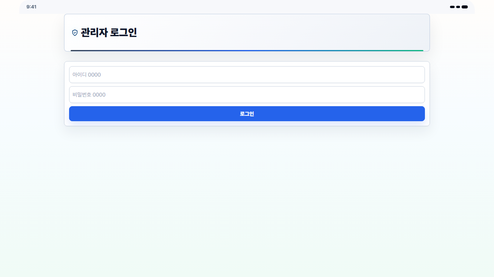
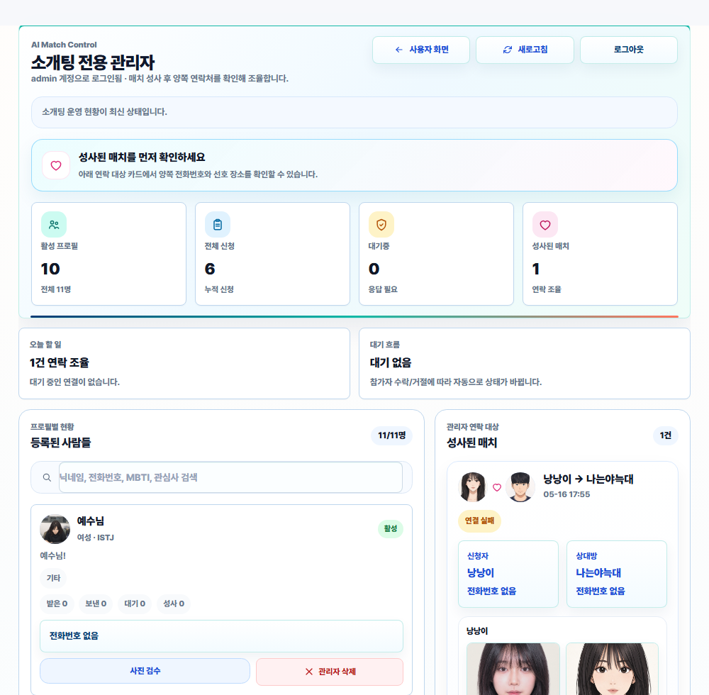
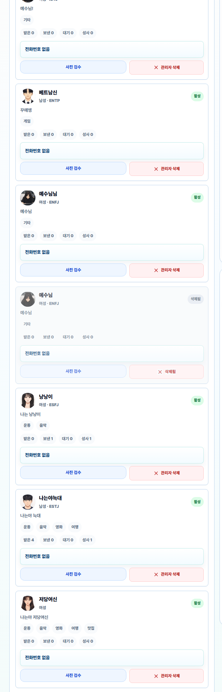
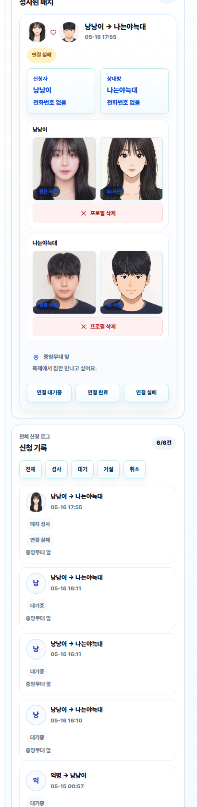
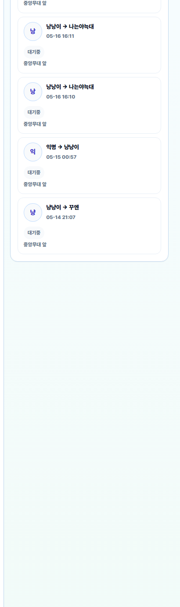

# AI Match 관리자 사용설명서

대상 화면: `/ai-match/admin`  
화면 기준: 데스크탑 모드

## 1. 관리자 로그인



1. 데스크탑 브라우저에서 `/ai-match/admin`으로 접속합니다.
2. 관리자 아이디와 비밀번호를 입력합니다.
3. `로그인` 버튼을 누릅니다.

로컬 개발 환경 기본 계정:

| 항목 | 값 |
| --- | --- |
| 아이디 | `0000` |
| 비밀번호 | `0000` |

> 실제 운영 환경에서는 배포 시 설정된 관리자 계정을 사용해야 합니다.

## 2. 관리자 대시보드 전체 구조



로그인 후 화면은 크게 네 영역으로 나뉩니다.

| 영역 | 설명 |
| --- | --- |
| 상단 액션 | 사용자 화면 이동, 새로고침, 로그아웃 |
| 운영 요약 | 활성 프로필, 전체 신청, 대기중, 성사된 매치 수 확인 |
| 등록된 사람들 | 프로필 검색, 상세 확인, 사진 검수, 관리자 삭제 |
| 성사된 매치 / 신청 기록 | 매칭된 사람의 연락처 확인, 연결 상태 변경, 메모 저장 |

## 3. 운영 요약 확인하기

대시보드 상단의 카드에서 현재 운영 상태를 빠르게 확인합니다.

- 활성 프로필: 현재 공개 중인 프로필 수
- 전체 신청: 누적 데이트 신청 수
- 대기중: 아직 응답이 필요한 신청 수
- 성사된 매치: 연결 조율이 필요한 매칭 수

관리자는 이 영역을 보고 오늘 처리해야 할 매칭이 있는지 먼저 확인합니다.

## 4. 등록된 사람들 관리



1. 왼쪽의 `등록된 사람들` 영역을 확인합니다.
2. 검색창에서 닉네임, 전화번호, MBTI, 관심사를 검색합니다.
3. 프로필 카드에서 성별, 관심사, 받은 신청, 보낸 신청, 대기 수, 성사 수를 확인합니다.
4. `사진 검수`를 눌러 원본 사진과 AI 변환 사진을 확인합니다.
5. 부적절한 프로필은 `관리자 삭제`로 비활성화합니다.

삭제 시 주의사항:

- 삭제된 프로필은 사용자 목록에서 보이지 않습니다.
- 해당 사용자는 PIN으로 프로필 관리 화면에 접근할 수 없습니다.
- 실수로 삭제하지 않도록 닉네임과 사진을 다시 확인한 뒤 진행합니다.

## 5. 성사된 매치 확인 및 연결 조율



1. 오른쪽의 `성사된 매치` 영역을 확인합니다.
2. 매칭된 두 사람의 닉네임과 프로필 사진을 확인합니다.
3. `상세 보기`를 눌러 양쪽 연락처와 사진을 확인합니다.
4. 필요한 경우 전화 또는 문자로 만남 장소와 시간을 안내합니다.
5. 처리 상태에 따라 `연결 대기중`, `연결 완료`, `연결 실패` 중 하나를 선택합니다.

상태 기준:

| 상태 | 의미 |
| --- | --- |
| 연결 대기중 | 아직 연락 또는 현장 안내가 완료되지 않음 |
| 연결 완료 | 양쪽에게 안내가 끝났고 만남 조율이 완료됨 |
| 연결 실패 | 연락 불가, 취소, 현장 사정 등으로 연결하지 못함 |

## 6. 관리자 메모 작성

성사된 매치 상세 영역에서 관리자 메모를 남길 수 있습니다.

메모에 적으면 좋은 내용:

- 연락 완료 시간
- 안내한 만남 장소
- 안내한 약속 시간
- 특이사항
- 연결 실패 사유

예시:

```text
18:20 신청자 전화 완료, 18:25 상대방 문자 발송.
19:00 중앙무대 앞 안내. 상대방이 10분 지연 가능하다고 말함.
```

## 7. 신청 기록 확인



신청 기록 영역에서는 전체 신청 로그를 확인합니다.

1. 신청자와 대상자를 확인합니다.
2. 신청 시간과 상태를 확인합니다.
3. 상태 필터로 `전체`, `성사`, `대기`, `거절`, `취소`를 선택합니다.
4. 관리자 메모가 있는 신청은 기록에서 함께 확인합니다.

이 영역은 분쟁 확인, 운영 이력 확인, 누락된 매칭 찾기에 사용합니다.

## 8. 운영 순서 요약

| 순서 | 관리자 작업 | 확인 위치 |
| --- | --- | --- |
| 1 | `/ai-match/admin` 로그인 | 로그인 화면 |
| 2 | 대기중/성사된 매치 수 확인 | 운영 요약 |
| 3 | 새로 등록된 프로필 확인 | 등록된 사람들 |
| 4 | 부적절한 프로필 삭제 | 프로필 카드 |
| 5 | 성사된 매치 상세 보기 | 성사된 매치 |
| 6 | 양쪽 연락처로 연결 조율 | 상세 보기 |
| 7 | 연결 상태 변경 | 연결 상태 버튼 |
| 8 | 처리 내용 메모 저장 | 관리자 메모 |

## 9. 관리자 주의사항

- 연락처는 운영 목적으로만 사용합니다.
- 사용자 사진은 검수 목적 외에 저장하거나 공유하지 않습니다.
- `관리자 삭제`는 되돌리기 어려우므로 신중하게 사용합니다.
- 매칭이 성사된 건은 가능한 빨리 연락해 현장 대기 시간을 줄입니다.
- 처리 후에는 반드시 연결 상태와 메모를 남겨 다음 관리자가 이어서 확인할 수 있게 합니다.
