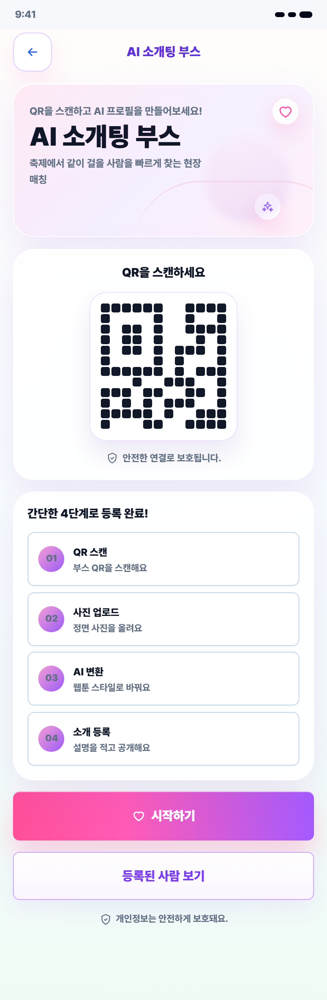
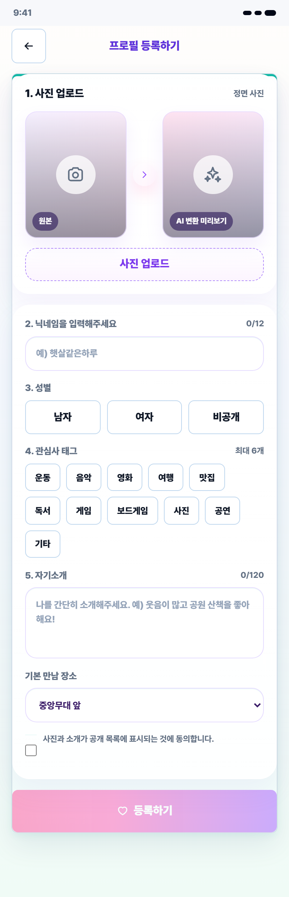
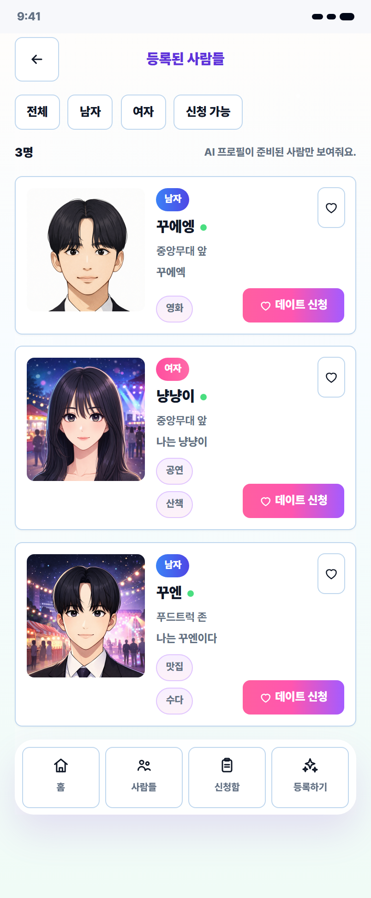
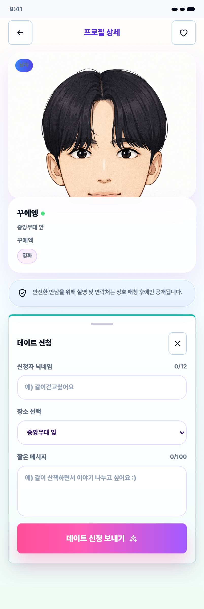
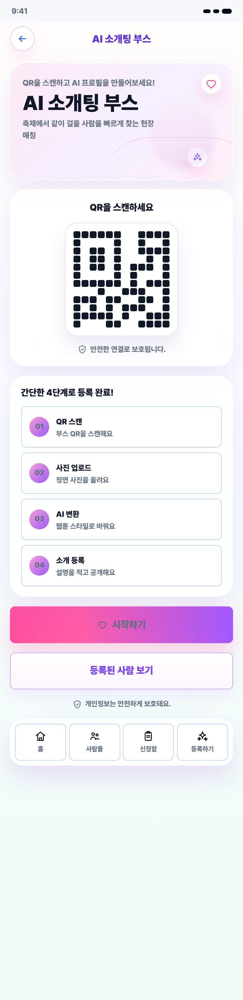

# AI Match 사용자 사용설명서

대상 화면: `/ai-match`  
화면 기준: 모바일 모드

## 1. AI 소개팅 부스 접속하기

1. 모바일 브라우저에서 서비스 주소로 접속합니다.
2. 첫 화면에서 `AI 소개팅 부스` 안내와 QR 영역을 확인합니다.
3. 처음 사용하는 경우 `시작하기`를 누릅니다.
4. 이미 등록된 사람을 보고 싶으면 `등록된 사람 보기`를 누릅니다.

> 개인정보는 공개 목록에 필요한 정보만 표시됩니다. 연락처와 상세 정보는 매칭 이후 운영 확인용으로 사용됩니다.

## 2. 프로필 등록하기

1. `사진 업로드`를 눌러 정면 사진을 올립니다.
2. AI 변환 미리보기가 생성되면 결과 이미지를 확인합니다.
3. 닉네임을 입력합니다.
4. 성별을 `남자`, `여자`, `비공개` 중에서 선택합니다.
5. 관심사 태그를 최대 6개까지 선택합니다.
6. 자기소개를 짧게 입력합니다.
7. 기본 만남 장소를 선택합니다.
8. 공개 동의 체크박스를 선택한 뒤 `등록하기`를 누릅니다.

등록할 때 주의할 점:

- 닉네임은 다른 사람과 구분하기 쉬운 이름으로 입력합니다.
- 사진이 없거나 AI 변환 이미지가 준비되지 않으면 신청 가능한 프로필로 보이지 않을 수 있습니다.
- 자기소개는 너무 길게 쓰기보다 상대가 알아보기 쉬운 한두 문장으로 적는 것이 좋습니다.

## 3. 등록된 사람 보기

1. 하단 메뉴에서 `사람들`을 누릅니다.
2. 등록된 프로필 목록을 확인합니다.
3. 상단 필터에서 `전체`, `남자`, `여자`, `신청 가능`을 선택해 목록을 좁힐 수 있습니다.
4. 마음에 드는 프로필이 있으면 하트 아이콘으로 관심 표시를 할 수 있습니다.
5. 프로필 카드의 `데이트 신청`을 누르면 상세 화면으로 이동합니다.

목록에서 확인할 수 있는 정보:

- AI 변환 프로필 이미지
- 성별
- 닉네임
- 기본 만남 장소
- 자기소개
- 관심사 태그
- 데이트 신청 버튼

## 4. 프로필 상세 확인 및 데이트 신청

1. 상대 프로필의 사진과 소개를 확인합니다.
2. `신청자 닉네임`을 입력합니다.
3. 만날 장소를 선택합니다.
4. 짧은 메시지를 작성합니다.
5. `데이트 신청 보내기`를 누릅니다.

메시지 작성 예시:

- 같이 산책하면서 이야기 나누고 싶어요.
- 공연 보러 같이 갈래요?
- 푸드트럭 존에서 같이 먹을 사람 찾고 있어요.

## 5. 신청함 확인하기

1. 하단 메뉴에서 `신청함`을 누릅니다.
2. 닉네임과 PIN 인증을 진행합니다.
3. 받은 신청과 보낸 신청을 확인합니다.
4. 받은 신청은 `수락` 또는 `거절`할 수 있습니다.
5. 보낸 신청은 대기 중일 때 취소할 수 있습니다.

## 6. 프로필 관리하기

신청함에 들어가면 본인 프로필 관리 영역을 사용할 수 있습니다.

- 프로필 수정: 사진, 소개, 관심사, 만남 장소를 변경합니다.
- 프로필 삭제: 공개 목록에서 본인 프로필을 삭제합니다.
- 다른 닉네임으로 열기: 다른 계정의 신청함을 확인할 때 사용합니다.

## 7. 사용 흐름 요약

| 단계 | 해야 할 일 | 화면 |
| --- | --- | --- |
| 1 | `/ai-match` 접속 | 소개 화면 |
| 2 | `시작하기` 선택 | 프로필 등록 |
| 3 | 사진 업로드 및 정보 입력 | 등록 화면 |
| 4 | `등록된 사람 보기` 선택 | 사람 목록 |
| 5 | 마음에 드는 사람에게 신청 | 상세 화면 |
| 6 | `신청함`에서 상태 확인 | 신청 관리 |

## 8. 자주 헷갈리는 부분

**사진을 꼭 올려야 하나요?**  
AI 프로필 이미지가 있어야 목록에서 더 잘 보이고 신청 가능한 상태로 표시됩니다.

**연락처가 바로 공개되나요?**  
일반 사용자 화면에서는 기본 프로필 정보만 보입니다. 연락처는 매칭 성사 후 관리자 운영 확인에 사용됩니다.

**PIN은 왜 필요한가요?**  
본인 프로필 수정, 신청함 확인, 신청 수락/거절 같은 기능을 보호하기 위해 사용합니다.

**신청을 보낸 뒤 바로 만나는 건가요?**  
상대가 수락해야 매칭이 성사됩니다. 이후 관리자가 연결 상태를 확인하고 운영합니다.
